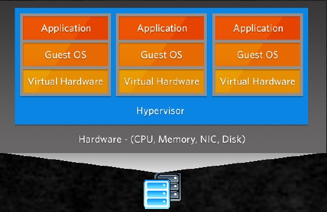
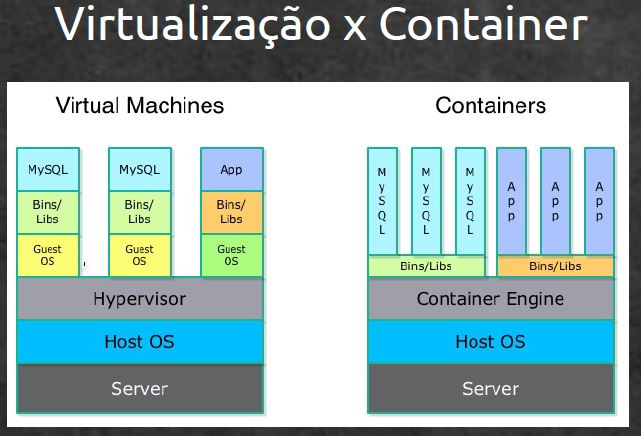
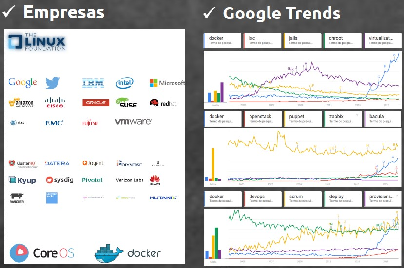
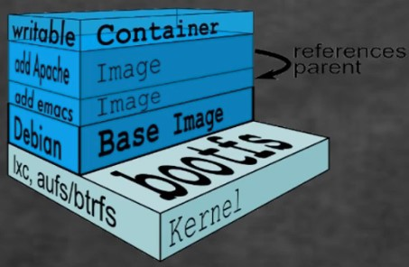
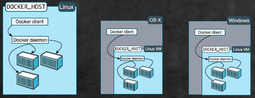

# Docker: Compreendendo e utilizando

https://www.udemy.com/docker-compreendendo-e-utilizando

Este curso tem como objetivo capacitar o aluno a entender a diferença entre Container X Virtualização, prós e contras dessas tecnologias, iniciar seu aprendizado em Docker, implementar Docker (infraestrutura de container) em seu dia a dia. E mais ... Integração com outros sistemas, topicos avançados e tudo que você procura saber sobre Docker.

## <a name="indice">Índice</a>

1. [Bem vindo](#parte1)     
2. [Introdução ao modulo](#parte2)     
3. [Conteiner ou Virtualização](#parte3)     
4. [Entendendo o Docker - Parte 1](#parte4)     
5. [Entendendo o Docker - Parte 2](#parte5)     
6. [Entendendo o Docker - Parte 3](#parte6)     
7. [Introdução ao modulo](#parte7)     
8. [Instalação e configuração do Docker](#parte8)     
9. [Introdução pratica ao Docker - Parte 1](#parte9)     
10. [Introdução pratica ao Docker - Parte 2](#parte10)     
11. [Introdução pratica ao Docker - Parte 3](#parte11)     
12. [Introdução pratica a Containers - Revisão, novas operações e interações](#parte12)     
13. [Privilegiando containers](#parte13)     
14. [Descartando containers](#parte14)     
15. [Trabalhando com variáveis de ambiente](#parte15)     
16. [Trabalhando com mapeamento de portas - Parte 1](#parte16)     
17. [Trabalhando com mapeamento de portas - Parte 2](#parte17)     
18. [Trabalhando com volumes - Parte 1](#parte18)     
19. [Trabalhando com volumes - Parte 2](#parte19)     
20. [Linkando containers - Parte 1](#parte20)     
21. [Linkando containers - Parte 2](#parte21)     
22. [Inspecionando containers](#parte22)     
23. [Exportando e Importando](#parte23)     
24. [Introdução pratica a imagens](#parte24)     
25. [Versionando imagens - Parte 1](#parte25)     
26. [Versionando imagens - Parte 2](#parte26)     
27. [Exportando e Importando](#parte27)     
28. [Entendendo o arquivo Dockerfile](#parte28)     
29. [Construindo aplicação pelo arquivo Dockerfile](#parte29)     
30. [Construindo aplicação SSH com Dockerfile](#parte30)     
31. [Introdução ao modulo](#parte31)     
32. [Introdução ao modulo](#parte32)     
33. [Parabéns](#parte33)     
---

## <a name="parte1">1 - Bem vindo</a>


[Voltar ao Índice](#indice)

---


## <a name="parte2">2 - Introdução ao modulo</a>


[Voltar ao Índice](#indice)

---


## <a name="parte3">3 - Conteiner ou Virtualização</a>


### virtualização
Em computação, virtualização é a simulação de uma plataforma de hardware, sistema operacional, dispositivo de armazenamento ou recursos de rede. 
Cada vez mais empresas estão buscando formas de reduzir os custos e complexidade com o ambiente de TI.  
A virtualização se tornou um componente chave para o desenvolvimento de uma estratégia eficiente na busca destes objetivos.  



Alguns detalhes importantes:
- O conceito vem da antiga !
- Hipervisor é a camada de administração da virtualização
- Existe alguns tipos de virtualização, exemplo: Full Virtualização, Para-Virtualização
- Alguns exemplos de software/plataforma/hipervisor: Xen, Citrix XenServer, VirtualBox, VMWare

### CONTAINER
Um container é uma forma de virtualização no nível do sistema operacional, um ambiente totalmente isolado, simulando um sistema independente no mesmo host.  
Com isso, é possível executar uma aplicação com todas as configurações necessárias(variáveis de ambiente, pacotes etc.) com o mínimo de impacto.

Alguns exemplos: FreeBSD Jails, OpenVZ, Outros ... LXC e Docker ...

### LXC: cgroups, namespace

#### cgroups
CGroups é uma feature do Kernel que provê mecanismos para organização de Processos em forma de grupos e limita recursos de máquina como: Consumo de CPU, memória e I/O.

#### namespace

Namespace é uma feature que permite o sistema criar diversos contextos diferentes em um mesmo sistema, ou seja, permite criar diferentes ambientes independentes que são executados no sistema base.

Com namespace eu consigo isolar um processo do ambiente de outro processo permitindo até mesmo que dois ou mais processos possuam o mesmo PID, porém em ambientes isolados. Permite que um sistema possua múltiplas visões, ou seja, que o sistema seja observado de diversas maneiras diferentes.

- https://www.opencontainers.org/ (Padronização, Investimentos)




[Voltar ao Índice](#indice)

---

## <a name="parte4">4 - Entendendo o Docker - Parte 1</a>

#### MERCADO x DOCKER



[Voltar ao Índice](#indice)

---

## <a name="parte5">5 - Entendendo o Docker - Parte 2</a>

#### PORQUE DOCKER ?

Porque com Docker você alcança a agilidade e controle das operações de TI construindo e executando qualquer aplicativo, em qualquer lugar!

Leve:  Containers compartilham o mesmo kernel do host logo faz uso mais eficiente dos recursos do sistema dendo um overhead menor que maquina virtual e com seu sistema de "layers" reaproveita grande parte dos dados, logo deixa downloads e armazenamento bem mais eficiente

Seguro: Containers isolam aplicativos uns dos outros e da própria infra-estrutura fornecendo uma camada adicional de proteção

Agiliza processos:  Com seus recursos de construção, herança, versionamento em segundos vocês realiza deploy da sua aplicações (ou aplicações) de forma inteligente e eficaz

Elimina inconsistência:  Como Docker empacota tudo (o sistema, libs, dependências, configuração) dentro do recipiente é possível trabalhar no ambiente de desenvolvimento, da mesma forma que o de produção, é entrega-lo exatamente como deve estar

Torna suas aplicações portáveis e padronizada:  Com os recursos Dockerfile, Dockerhub ou mesmo repositório git's em questão de segundos você distribuído (ou porta) sua aplicação de forma padronizada e documentada

O que mais: Link's entre containers, mapeamento de porta, restrição de recursos, deploy de ambiente (compose), gestão de volumes, descarte ao final --rm), Registry v2, Dockerhub etc ... Bem alguns termos: isolamento, segurança, produtividade, agilidade, INTELIGENCIA...

#### ESTRUTURA

Componentes:

- **Docker Engine/server:**  É o “Docker” propriamente dito. Ele é instalado nos Hosts e efetua a criação e a execução dos Containers de aplicações.
- **Docker Client/cli:**  É o componente onde o administrador emite os comandos que serão enviados para o Docker Engine (server).
- **Docker Hub:** É um repositório de imagens dos Containers. Basta criar uma conta e começar a usá-lo nos projetos.

Recursos/Funções:

- **Containers:**  Containers são criados a partir das imagens do Dockere eles são as instâncias reais de nossos containers. Eles podem ser iniciados, executados, parados, deletados, e movidos.
- **Imagens:**  Uma imagem nada mais é do que um ambiente totalmente encapsulado e pronto para ser replicado onde desejar.
- **Build (Dockerfiles):** Dockerfile nada mais é do que um arquivo de definição onde é possível realizar ou preparar todo ambiente a partir de um script de execução.
- **Volumes de dados:**  É uma função para realizarmos a persistência de dados uma vez que containers são projetados para descarta-lo após seu uso.
- **Mapeamento de Porta:**  Por padrão Docker não exporta suas portas para o mundo real, Mapeamento de dados é a função para expor essas portas no host 
- **Link entre container:**  Links são a funções de um container se comunicar diretamente com outro sem a necessidade de expo-lo para a rede real.

[Voltar ao Índice](#indice)

---

## <a name="parte6">6 - Entendendo o Docker - Parte 3</a>

#### Filesystem Multilayer

1. bootfs: Onde ficam o sistema de Boot do sistema e o Kernel.
2. rootfs (read only):  Inclui o sistema de arquivo do sistema, incluindo a arquitetura de diretório, em sistemas unix-like: /dev, /proc, /bin, /etc, /lib, /usr, e /tmp assim como os arquivos de configuração e binários do sistema.
3. rootfs (read/write)



- Docker machine: É um componente para automatizar a criação dos hostspara o provisionamento de containers.
- Docker Swarm: é usado para a criação dos clusters dos Hosts Docker.
- Docker compose: É usado para definir as aplicações multi-container.

[Voltar ao Índice](#indice)

---

## <a name="parte7">7 - Introdução ao modulo</a>

- Nativo apenas em LINUX
- Mac OS X
- Windows



AMBIENTE DO CURSO:

- VirtualBox 5.0.10 <https://www.virtualbox.org/>
- Ubuntu 14.04 Server
- Docker 1.9

<https://docs.docker.com/>

[Voltar ao Índice](#indice)

---

## <a name="parte8">8 - Instalação e configuração do Docker</a>

- https://docs.docker.com/install/linux/docker-ce/ubuntu/#set-up-the-repository


- Material Curso: 

```
# Preparando o ambientE

sudo apt-key adv --keyserver hkp://p80.pool.sks-keyservers.net:80 --recv-keys 58118E89F3A912897C070ADBF76221572C52609D
sudo echo "deb https://apt.dockerproject.org/repo ubuntu-trusty main" > /etc/apt/sources.list.d/docker.list

sudo apt-get update
sudo apt-get purge lxc-docker
sudo apt-cache policy docker-engine

sudo apt-get install linux-image-extra-$(uname -r)

# Instalando

sudo apt-get install docker-engine
sudo service docker start

# Testando

sudo docker info
sudo docker run hello-world

```

Realizado:

[DESCOMPLICANDO O DOCKER V1 - 05 - Instalando o Docker](https://www.youtube.com/watch?v=FTxBa7i8VMM)

```
$ sudo docker info
[sudo] password for josemalcher:
Containers: 0
 Running: 0
 Paused: 0
 Stopped: 0
Images: 0
Server Version: 18.09.0
Storage Driver: overlay2
 Backing Filesystem: extfs
 Supports d_type: true
 Native Overlay Diff: true
Logging Driver: json-file
Cgroup Driver: cgroupfs
Plugins:
 Volume: local
 Network: bridge host macvlan null overlay
 Log: awslogs fluentd gcplogs gelf journald json-file local logentries splunk syslog
Swarm: inactive
Runtimes: runc
Default Runtime: runc
Init Binary: docker-init
containerd version: c4446665cb9c30056f4998ed953e6d4ff22c7c39
runc version: 4fc53a81fb7c994640722ac585fa9ca548971871
init version: fec3683
Security Options:
 apparmor
 seccomp
  Profile: default
Kernel Version: 4.15.0-43-generic
Operating System: Ubuntu 18.04.1 LTS
OSType: linux
Architecture: x86_64
CPUs: 1
Total Memory: 1.923GiB
Name: serverubuntu
ID: #########################################(apagado)
Docker Root Dir: /var/lib/docker
Debug Mode (client): false
Debug Mode (server): false
Registry: https://index.docker.io/v1/
Labels:
Experimental: false
Insecure Registries:
 127.0.0.0/8
Live Restore Enabled: false
Product License: Community Engine

WARNING: No swap limit support
```

**docker run hello-world**

```
root@serverubuntu:/home/josemalcher# docker run hello-world
Unable to find image 'hello-world:latest' locally
latest: Pulling from library/hello-world
d1725b59e92d: Pull complete
Digest: sha256:b3a26e22bf55e4a5232b391281fc1673f18462b75cdc76aa103e6d3a2bce5e77
Status: Downloaded newer image for hello-world:latest

Hello from Docker!
This message shows that your installation appears to be working correctly.

To generate this message, Docker took the following steps:
 1. The Docker client contacted the Docker daemon.
 2. The Docker daemon pulled the "hello-world" image from the Docker Hub.
    (amd64)
 3. The Docker daemon created a new container from that image which runs the
    executable that produces the output you are currently reading.
 4. The Docker daemon streamed that output to the Docker client, which sent it
    to your terminal.

To try something more ambitious, you can run an Ubuntu container with:
 $ docker run -it ubuntu bash

Share images, automate workflows, and more with a free Docker ID:
 https://hub.docker.com/

For more examples and ideas, visit:
 https://docs.docker.com/get-started/

```

[Voltar ao Índice](#indice)

---


## <a name="parte9">9 - Introdução pratica ao Docker - Parte 1</a>

Comandos:

- docker ps

```
# docker ps
CONTAINER ID        IMAGE               COMMAND             CREATED             STATUS              PORTS               NAMES
```

- docker ps -a

```
# docker ps -a
CONTAINER ID        IMAGE               COMMAND             CREATED             STATUS                  PORTS               NAMES
e2fa1d02a838        hello-world         "/hello"            2 days ago          Exited (0) 2 days ago                       gallant_banzai
```

- doker help ps

```
#docker help ps

Usage:  docker ps [OPTIONS]

List containers

Options:
  -a, --all             Show all containers (default shows just running)
  -f, --filter filter   Filter output based on conditions provided
      --format string   Pretty-print containers using a Go template
  -n, --last int        Show n last created containers (includes all states) (default -1)
  -l, --latest          Show the latest created container (includes all states)
      --no-trunc        Don't truncate output
  -q, --quiet           Only display numeric IDs
  -s, --size            Display total file sizes

```

- docker run --name exemplo1 -d -t ubuntu

```
# docker run --name exemplo1 -d -t ubuntu
Unable to find image 'ubuntu:latest' locally
latest: Pulling from library/ubuntu
84ed7d2f608f: Pull complete
be2bf1c4a48d: Pull complete
a5bdc6303093: Pull complete
e9055237d68d: Pull complete
Digest: sha256:868fd30a0e47b8d8ac485df174795b5e2fe8a6c8f056cc707b232d65b8a1ab68
Status: Downloaded newer image for ubuntu:latest
6ce308ac8ac03f9e145b88de8d21391e8e31b559bc612a16f12c70db0993a547

# docker ps
CONTAINER ID        IMAGE               COMMAND             CREATED             STATUS              PORTS               NAMES
6ce308ac8ac0        ubuntu              "/bin/bash"         47 seconds ago      Up 43 seconds                           exemplo1

```

- docker run --name exemplo2 -i -t ubuntu /bin/bash

```
# docker run --name exemplo2 -i -t ubuntu /bin/bash
root@ac5245980fee:/#

# exit
exit
root@serverubuntu:/home/josemalcher#
```

- Crtl + p q

```
# docker run --name exemplo3 -i -t ubuntu /bin/bash
root@f040d3353ccc:/#  # root@serverubuntu:/home/josemalcher# docker ps
CONTAINER ID        IMAGE               COMMAND             CREATED              STATUS              PORTS               NAMES
f040d3353ccc        ubuntu              "/bin/bash"         About a minute ago   Up About a minute                       exemplo3
6ce308ac8ac0        ubuntu              "/bin/bash"         11 minutes ago       Up 11 minutes                           exemplo1
```

- docker exec -i -t exemplo3 bash

```
# docker ps
CONTAINER ID        IMAGE               COMMAND             CREATED             STATUS              PORTS               NAMES
f040d3353ccc        ubuntu              "/bin/bash"         5 minutes ago       Up 4 minutes                            exemplo3
6ce308ac8ac0        ubuntu              "/bin/bash"         15 minutes ago      Up 14 minutes                           exemplo1

root@serverubuntu:/home/josemalcher# docker exec -i -t exemplo3 bash
root@f040d3353ccc:/#

# docker exec -i -t exemplo3 ps aux
USER       PID %CPU %MEM    VSZ   RSS TTY      STAT START   TIME COMMAND
root         1  0.0  0.1  18508  3152 pts/0    Ss+  00:19   0:00 /bin/bash
root        20  0.2  0.1  18508  3412 pts/1    Ss+  00:29   0:00 bash
root        30  0.0  0.1  34400  2868 pts/2    Rs+  00:29   0:00 ps aux
root@serverubuntu:/home/josemalcher# docker exec -i -t exemplo3 bash

root@f040d3353ccc:/#
root@serverubuntu:/home/josemalcher# docker exec -i -t exemplo3 ps aux
USER       PID %CPU %MEM    VSZ   RSS TTY      STAT START   TIME COMMAND
root         1  0.0  0.1  18508  3152 pts/0    Ss+  00:19   0:00 /bin/bash
root        20  0.1  0.1  18508  3412 pts/1    Ss+  00:29   0:00 bash
root        35  0.7  0.1  18508  3116 pts/2    Ss+  00:29   0:00 bash
root        44  0.0  0.1  34400  2960 pts/3    Rs+  00:30   0:00 ps aux
```

- docker exec exemplo3 kill -TERM 35

```
# docker exec -i -t exemplo3 ps aux
USER       PID %CPU %MEM    VSZ   RSS TTY      STAT START   TIME COMMAND
root         1  0.0  0.1  18508  3152 pts/0    Ss+  00:19   0:00 /bin/bash
root        20  0.1  0.1  18508  3412 pts/1    Ss+  00:29   0:00 bash
root        35  0.7  0.1  18508  3116 pts/2    Ss+  00:29   0:00 bash
root        44  0.0  0.1  34400  2960 pts/3    Rs+  00:30   0:00 ps aux

root@serverubuntu:/home/josemalcher# docker exec exemplo3 kill -TERM 35

root@serverubuntu:/home/josemalcher# docker exec -i -t exemplo3 ps aux
USER       PID %CPU %MEM    VSZ   RSS TTY      STAT START   TIME COMMAND
root         1  0.0  0.1  18508  3152 pts/0    Ss+  00:19   0:00 /bin/bash
root        20  0.0  0.1  18508  3412 pts/1    Ss+  00:29   0:00 bash
root        54  7.0  0.1  34400  2868 pts/2    Rs+  00:31   0:00 ps aux
root@serverubuntu:/home/josemalcher#
```

[Voltar ao Índice](#indice)

---


## <a name="parte10">10 - Introdução pratica ao Docker - Parte 2</a>

- docker stop exemplo5

```
 docker ps
CONTAINER ID        IMAGE               COMMAND             CREATED             STATUS              PORTS               NAMES
ffe6225387b2        ubuntu              "/bin/bash"         11 seconds ago      Up 9 seconds                            exemplo5
f3014608eb41        ubuntu              "/bin/bash"         34 seconds ago      Up 31 seconds                           exemplo4
root@serverubuntu:/home/josemalcher# docker stop exemplo5
exemplo5
root@serverubuntu:/home/josemalcher# docker ps
CONTAINER ID        IMAGE               COMMAND             CREATED              STATUS              PORTS               NAMES
f3014608eb41        ubuntu              "/bin/bash"         About a minute ago   Up About a minute                       exemplo4
```

- docker start exemplo5

```
 docker ps -a
CONTAINER ID        IMAGE               COMMAND             CREATED             STATUS                     PORTS               NAMES
ffe6225387b2        ubuntu              "/bin/bash"         2 minutes ago       Exited (0) 2 minutes ago                       exemplo5
f3014608eb41        ubuntu              "/bin/bash"         3 minutes ago       Up 2 minutes                                   exemplo4
f040d3353ccc        ubuntu              "/bin/bash"         36 hours ago        Exited (0) 9 hours ago                         exemplo3
ac5245980fee        ubuntu              "/bin/bash"         36 hours ago        Exited (0) 36 hours ago                        exemplo2
6ce308ac8ac0        ubuntu              "/bin/bash"         36 hours ago        Exited (0) 9 hours ago                         exemplo1
e2fa1d02a838        hello-world         "/hello"            3 days ago          Exited (0) 3 days ago                          gallant_banzai
root@serverubuntu:/home/josemalcher# docker start exemplo5
exemplo5
root@serverubuntu:/home/josemalcher# docker ps
CONTAINER ID        IMAGE               COMMAND             CREATED             STATUS              PORTS               NAMES
ffe6225387b2        ubuntu              "/bin/bash"         3 minutes ago       Up 3 seconds                            exemplo5
f3014608eb41        ubuntu              "/bin/bash"         3 minutes ago       Up 3 minutes                            exemplo4
```

- docker images

```
# docker images
REPOSITORY          TAG                 IMAGE ID            CREATED             SIZE
ubuntu              latest              1d9c17228a9e        6 days ago          86.7MB
hello-world         latest              4ab4c602aa5e        3 months ago        1.84kB
```

- docker pull ubuntu:14.04

```
# docker pull ubuntu:14.04
14.04: Pulling from library/ubuntu
9b316e271c60: Pull complete
dea703e2e1f1: Pull complete
dd50fddc64ae: Pull complete
9d32d2e6dcde: Pull complete
Digest: sha256:2ceb8f8fef6dfa7433c992efdedc90c35b572747f34d9bac726e18a9e086e95e
Status: Downloaded newer image for ubuntu:14.04

root@serverubuntu:/home/josemalcher# docker images
REPOSITORY          TAG                 IMAGE ID            CREATED             SIZE
ubuntu              14.04               7e4b16ae8b23        6 days ago          188MB
ubuntu              latest              1d9c17228a9e        6 days ago          86.7MB
hello-world         latest              4ab4c602aa5e        3 months ago        1.84kB
```

- docker run --name exemplo6 -d -t -p 80:80 nginx

```
 # docker run --name exemplo6 -d -t -p 80:80 nginx
c5c75f48167d645330f1e704d4d4880e58c87c0837def6baae4e47c924be92e0

# docker ps
CONTAINER ID        IMAGE               COMMAND                  CREATED             STATUS              PORTS                NAMES
c5c75f48167d        nginx               "nginx -g 'daemon of…"   2 minutes ago       Up About a minute   0.0.0.0:80->80/tcp   exemplo6
ffe6225387b2        ubuntu              "/bin/bash"              7 hours ago         Up 7 hours                               exemplo5
f3014608eb41        ubuntu              "/bin/bash"              7 hours ago         Up 7 hours                               exemplo4
```

- docker rm exemplo1

```
r# docker ps
CONTAINER ID        IMAGE               COMMAND             CREATED             STATUS              PORTS               NAMES
root@serverubuntu:/home/josemalcher# docker ps -a
CONTAINER ID        IMAGE               COMMAND                  CREATED             STATUS                          PORTS               NAMES
c5c75f48167d        nginx               "nginx -g 'daemon of…"   12 minutes ago      Exited (0) About a minute ago                       exemplo6
ffe6225387b2        ubuntu              "/bin/bash"              7 hours ago         Exited (0) About a minute ago                       exemplo5
f3014608eb41        ubuntu              "/bin/bash"              7 hours ago         Exited (0) About a minute ago                       exemplo4
f040d3353ccc        ubuntu              "/bin/bash"              43 hours ago        Exited (0) 15 hours ago                             exemplo3
ac5245980fee        ubuntu              "/bin/bash"              43 hours ago        Exited (0) 43 hours ago                             exemplo2
6ce308ac8ac0        ubuntu              "/bin/bash"              43 hours ago        Exited (0) 15 hours ago                             exemplo1
e2fa1d02a838        hello-world         "/hello"                 3 days ago          Exited (0) 3 days ago                               gallant_banzai
root@serverubuntu:/home/josemalcher# docker rm exemplo1
exemplo1
root@serverubuntu:/home/josemalcher# docker ps -a
CONTAINER ID        IMAGE               COMMAND                  CREATED             STATUS                          PORTS               NAMES
c5c75f48167d        nginx               "nginx -g 'daemon of…"   13 minutes ago      Exited (0) About a minute ago                       exemplo6
ffe6225387b2        ubuntu              "/bin/bash"              7 hours ago         Exited (0) About a minute ago                       exemplo5
f3014608eb41        ubuntu              "/bin/bash"              7 hours ago         Exited (0) About a minute ago                       exemplo4
f040d3353ccc        ubuntu              "/bin/bash"              43 hours ago        Exited (0) 15 hours ago                             exemplo3
ac5245980fee        ubuntu              "/bin/bash"              43 hours ago        Exited (0) 43 hours ago                             exemplo2
e2fa1d02a838        hello-world         "/hello"                 3 days ago          Exited (0) 3 days ago                               gallant_banzai
```

- docker rmi ubuntu:14.04

```
# docker images
REPOSITORY          TAG                 IMAGE ID            CREATED             SIZE
nginx               latest              7042885a156a        6 days ago          109MB
ubuntu              14.04               7e4b16ae8b23        6 days ago          188MB
ubuntu              latest              1d9c17228a9e        6 days ago          86.7MB
hello-world         latest              4ab4c602aa5e        3 months ago        1.84kB
root@serverubuntu:/home/josemalcher# docker rmi ubuntu:14.04
Untagged: ubuntu:14.04
Untagged: ubuntu@sha256:2ceb8f8fef6dfa7433c992efdedc90c35b572747f34d9bac726e18a9e086e95e
Deleted: sha256:7e4b16ae8b23e239ab03a413febb51e204e294cb2bf0e45cc4aa7bed7d7f704e
Deleted: sha256:31fee1a1223e18212fbfabdbc6c1d858539736e72ebc6e5656b5bbe1a6a3e6f0
Deleted: sha256:46eadf76580d8e4b62992ec2a5ad6fbe665a2315e249dae0f93b79137694b6bf
Deleted: sha256:e41a350db85f18619768eadfb3b8e4e72e07318486614a5acf708fdd45781c4c
Deleted: sha256:a1dfb45ac02d4300506f63948d1a9d1bc9e354d0643412e6b88cc9dec820216f
root@serverubuntu:/home/josemalcher# docker images
REPOSITORY          TAG                 IMAGE ID            CREATED             SIZE
nginx               latest              7042885a156a        6 days ago          109MB
ubuntu              latest              1d9c17228a9e        6 days ago          86.7MB
hello-world         latest              4ab4c602aa5e        3 months ago        1.84kB
```


[Voltar ao Índice](#indice)

---


## <a name="parte11">11 - Introdução pratica ao Docker - Parte 3</a>

- \Exemplo5\Dockerfile
- docker build -t nginx-exemplo:v2 .

```
# docker build -t nginx-exemplo:v2 .
Sending build context to Docker daemon  2.048kB
Step 1/3 : FROM nginx
 ---> 7042885a156a
Step 2/3 : RUN sed -i 's/Welcome to nginx!/Bem vindo  ao exemplo 5 <br> Via Dockerfile/g' /usr/share/nginx/html/index.html
 ---> Using cache
 ---> b398a10ef777
Step 3/3 : RUN ls '/tmp'
 ---> Running in ffb671cb4939
Removing intermediate container ffb671cb4939
 ---> 653db82a75fd
Successfully built 653db82a75fd
Successfully tagged nginx-exemplo:v2

# docker images
REPOSITORY          TAG                 IMAGE ID            CREATED             SIZE
nginx-exemplo       v2                  653db82a75fd        6 seconds ago       109MB
nginx-exemplo1      v1                  b398a10ef777        5 minutes ago       109MB
nginx               latest              7042885a156a        6 days ago          109MB
ubuntu              latest              1d9c17228a9e        6 days ago          86.7MB
hello-world         latest              4ab4c602aa5e        3 months ago        1.84kB
```

-  docker run --name exemplo51 -d -t -p 80:80 nginx-exemplo:v2

```
# docker run --name exemplo51 -d -t -p 80:80 nginx-exemplo:v2
920d626b272026462879e3bd5de93bd7b89c7556e625a29a55e9672204f6a9bd
root@serverubuntu:/home/josemalcher/exemplo5# docker ps
CONTAINER ID        IMAGE               COMMAND                  CREATED             STATUS              PORTS                NAMES
920d626b2720        nginx-exemplo:v2    "nginx -g 'daemon of…"   5 seconds ago       Up 4 seconds        0.0.0.0:80->80/tcp   exemplo51
```

[Voltar ao Índice](#indice)

---


## <a name="parte12">12 - Introdução pratica a Containers - Revisão, novas operações e interações</a>

- docker restart exemplo6
- docker pause exemplo6
- docker unpause exemplo6
- docker kill exemplo6
- docker attach exemplo6 (ctrl + p +q)

copiar aqrquivos para container:

- docker cp exemplo6:/tmp/arquivos1 ./ (copiar container ex6 para pasta local ./)

Nomear hostname

- docker run -it --name exemplo6.c --hostname exemplo6host ubuntu /bin/bash

```
# docker run -it --name exemplo6.b ubuntu /bin/bash
root@91bd5885378f:/#
root@91bd5885378f:/# exit
exit

root@serverubuntu:/home/josemalcher# docker run -it --name exemplo6.c --hostname exemplo6host ubuntu /bin/bash
root@exemplo6host:/#
```

[Voltar ao Índice](#indice)

---


## <a name="parte13">13 - Privilegiando containers</a>

Baixando img
- docker pull andyshinn/dnsmasq

Privilégio total:
- docker run -dt --name exemplo7 --privileged andyshinn/dnsmasq

Específico: (placa de rede)
- docker run -dt --name exemplo7 --cap-add=NET_ADMIN andyshinn/dnsmasq

[Voltar ao Índice](#indice)

---


## <a name="parte14">14 - Descartando containers</a>

Script bash para ficar verificando o status docker:

```bash
function docker.ps.loop(){
    watch -n 3 -t "docker ps --format '{{.Names}},{{.Image}}\n{{.Status}}, PORTA: {{.Ports}}\n'"
}
```

**Recarregar o Bash: # source ~/.bashrc**

- docker run -it --rm --name exemplo8 --hostname exempli8 -p 80:80 -v /home/josemalcher/exemplo8/index.html:/usr/share/nginx/html/index.html nginx-exemplo1:v1

"--rm" descarta o container ao sair.

```
docker run -i --rm --name exemplo8 --hostname exempli8 -p 80:80 -v /home/josemalcher/exemplo8/index.html:/usr/share/nginx/html/index.html nginx-exemplo1:v1

exemplo8,nginx-exemplo1:v1
Up 45 seconds, PORTAS: 0.0.0.0:80->80/tcp
```

[Voltar ao Índice](#indice)

---


## <a name="parte15">15 - Trabalhando com variáveis de ambiente</a>

- https://hub.docker.com/r/sameersbn/mysql

- v=A0502E01 ; docker run -it --rm --name $v --hostname $v -e 'X=varival1' --env='Y=variavel2' ubuntu /bin/bash

```
# v=A0502E01 ; docker run -it --rm --name $v --hostname $v -e 'X=varival1' --env='Y=variavel2' ubuntu /bin/bash

root@A0502E01:/# echo "Imprimindo valor de X: $X, Y:$Y e Z:$Z"
Imprimindo valor de X: varival1, Y:variavel2 e Z:

```

- v=A0502E02 ; docker run -it --rm --name $v --hostname $v -e 'DB_NAME=db' -e 'DB_USER=user1' -e 'DB_PASS=123' sameersbn/mysql

```
# v=A0502E02 ; docker run -it --rm --name $v --hostname $v -e 'DB_NAME=db' -e 'DB_USER=user1' -e 'DB_PASS=123' sameersbn/mysql
Installing database...
Starting MySQL server...
Waiting for database server to accept connections.
Creating debian-sys-maint user...
Creating database "db"...
Granting access to database "db" for user "user1"...
2019-01-06T21:41:37.379842Z mysqld_safe Logging to syslog.
2019-01-06T21:41:37.428114Z mysqld_safe Starting mysqld daemon with databases from /var/lib/mysql

# docker exec -it A0502E02 mysql -u user1 --password=123

mysql: [Warning] Using a password on the command line interface can be insecure.
Welcome to the MySQL monitor.  Commands end with ; or \g.
Your MySQL connection id is 3
Server version: 5.7.22-0ubuntu18.04.1 (Ubuntu)

Copyright (c) 2000, 2018, Oracle and/or its affiliates. All rights reserved.

Oracle is a registered trademark of Oracle Corporation and/or its
affiliates. Other names may be trademarks of their respective
owners.

Type 'help;' or '\h' for help. Type '\c' to clear the current input statement.

mysql> show databases;
+--------------------+
| Database           |
+--------------------+
| information_schema |
| db                 |
+--------------------+
2 rows in set (0.00 sec)

mysql>
```

**Variáveis dentro de arquivos**

```
# v=A0502E03 ; docker run -it --rm --name $v --hostname $v --env-file=/home/josemalcher/exemplo9/variaveisDB sameersbn/mysql
Installing database...
Starting MySQL server...
Waiting for database server to accept connections.
Creating debian-sys-maint user...
Creating database "db_arquivovar"...
Granting access to database "db_arquivovar" for user "user2"...
2019-01-06T21:51:46.178424Z mysqld_safe Logging to syslog.
2019-01-06T21:51:46.220244Z mysqld_safe Starting mysqld daemon with databases from /var/lib/mysql

# docker exec -it A0502E03 mysql -u user2 --password=12356
mysql: [Warning] Using a password on the command line interface can be insecure.
ERROR 1045 (28000): Access denied for user 'user2'@'localhost' (using password: YES)

# docker exec -it A0502E03 mysql -u user2 --password=123456
mysql: [Warning] Using a password on the command line interface can be insecure.
Welcome to the MySQL monitor.  Commands end with ; or \g.
Your MySQL connection id is 3
Server version: 5.7.22-0ubuntu18.04.1 (Ubuntu)

Copyright (c) 2000, 2018, Oracle and/or its affiliates. All rights reserved.

Oracle is a registered trademark of Oracle Corporation and/or its
affiliates. Other names may be trademarks of their respective
owners.

Type 'help;' or '\h' for help. Type '\c' to clear the current input statement.

mysql> show databases;
+--------------------+
| Database           |
+--------------------+
| information_schema |
| db_arquivovar      |
+--------------------+
2 rows in set (0.00 sec)

```


[Voltar ao Índice](#indice)

---

## <a name="parte16">16 - Trabalhando com mapeamento de portas - Parte 1</a>

```
    # docker run -dt --name aulaEx1-a ubuntu /bin/bash

    # docker run -dt --name aulaEx1-b -p 8080:80 ubuntu /bin/bash


aulaEx1-b,ubuntu
Up 59 seconds, PORTA: 0.0.0.0:8080->80/tcp

aulaEx1-a,ubuntu
Up About a minute, PORTA:
```

```
    # docker port aulaEx1-b
    80/tcp -> 0.0.0.0:8080
```

Mapeamento mais de uma porta

```
# docker run -dt --name aulaEx3-a -p 23:23 -p 81-85:81-85 ubuntu /bin/bash

aulaEx3-a,ubuntu
Up 15 seconds, PORTA: 0.0.0.0:23->23/tcp, 0.0.0.0:81-85->81-85/tcp
```

Determinar ip de restrição

```
# docker run -dt --name aulaEx3-b -p 192.168.0.102:24:24 ubuntu /bin/bash

aulaEx3-b,ubuntu
Up 25 seconds, PORTA: 192.168.0.102:24->24/tcp

```

Redirecionar para porta udp

```
# docker run -dt --name aulaEx3-c -p 54:54/udp ubuntu /bin/bash

aulaEx3-c,ubuntu
Up 21 seconds, PORTA: 0.0.0.0:54->54/udp
```

Exemplo de muitas portas

```
# docker run -dt --name aulaEx5-d -p 54-55:54-55/udp -p 192.168.0.102:100:101/tcp -p 86-89:96-99 ubuntu /bin/bash

aulaEx5-d,ubuntu
Up 19 seconds, PORTA: 0.0.0.0:54-55->54-55/udp, 0.0.0.0:86->96/tcp, 0.0.0.0:87->97/tcp, 0.0.0.0:88->98/tcp, 0.0.0.0:89->99/tcp, 192.168.0.102:100->1
01/tcp

```


[Voltar ao Índice](#indice)

---


## <a name="parte17">17 - Trabalhando com mapeamento de portas - Parte 2</a>

```
# docker run -dt --name Aula17.a -P nginx

Aula17.a,nginx
Up 18 seconds, PORTA: 0.0.0.0:32768->80/tcp
```


[Voltar ao Índice](#indice)

---


## <a name="parte18">18 - Trabalhando com volumes - Parte 1</a>

```

# docker run -it --rm --name Aula18Ex1 
  -v /home/josemalcher/Documentos/workspace-Docker/udemy-Docker-Compreendendo-e-utilizando/18-Trabalhando-com-volumes-Parte-1:/tmp/Ex01:Z ubuntu /bin/bash

```

- ":Z" Parâmetro aidiconado: http://www.projectatomic.io/blog/2015/06/using-volumes-with-docker-can-cause-problems-with-selinux/
- ":ro" Ready only - Somente para leitura

```
# docker run -it --rm --name Aula18Ex3 
-v /home/josemalcher/Documentos/workspace-Docker/udemy-Docker-Compreendendo-e-utilizando/18-Trabalhando-com-volumes-Parte-1/Exemplo1:/home/Exemplo1:Z 
-v /home/josemalcher/Documentos/workspace-Docker/udemy-Docker-Compreendendo-e-utilizando/18-Trabalhando-com-volumes-Parte-1/Exemplo2:/home/Exemplo2:Z ubuntu /bin/bash
```

Prática com Mysql

```
# docker run -i --rm --name Aula18Ex4 -v /home/josemalcher/Documentos/workspace-Docker/udemy-Docker-Compreendendo-e-utilizando/18-Trabalhando-com-volumes-Parte-1/ArquivosBD/:/var/lib/mysql:Z -e 'DB_NAME=db1' -e 'DB_USER=user1' -e 'DB_PASS=123' sameersbn/mysqlInstalling database...

Starting MySQL server...
Waiting for database server to accept connections.
Creating debian-sys-maint user...
Creating database "db1"...
Granting access to database "db1" for user "user1"...
2019-05-03T00:40:55.157354Z mysqld_safe Logging to syslog.
2019-05-03T00:40:55.174405Z mysqld_safe Starting mysqld daemon with databases from /var/lib/mysql

Aula18Ex4,sameersbn/mysql
Up 31 seconds, PORTA: 3306/tcp

[ArquivosBD] # ls

auto.cnf  db1  ib_buffer_pool  ibdata1  ib_logfile0  ib_logfile1  ibtmp1  mysql  performance_schema  sys

# docker exec -it Aula18Ex4 mysql -u user1 --password=123

mysql: [Warning] Using a password on the command line interface can be insecure.
Welcome to the MySQL monitor.  Commands end with ; or \g.
Your MySQL connection id is 2
Server version: 5.7.24-0ubuntu0.18.04.1 (Ubuntu)

Copyright (c) 2000, 2018, Oracle and/or its affiliates. All rights reserved.

Oracle is a registered trademark of Oracle Corporation and/or its
affiliates. Other names may be trademarks of their respective
owners.

Type 'help;' or '\h' for help. Type '\c' to clear the current input statement.

mysql> show databases;
+--------------------+
| Database           |
+--------------------+
| information_schema |
| db1                |
+--------------------+
2 rows in set (0.00 sec)

mysql> 

```

Exemplo 2 - Adicionando outro Banco

```
# docker run -i --rm --name Aula18Ex5 -v /home/josemalcher/Documentos/workspace-Docker/udemy-Docker-Compreendendo-e-utilizando/18-Trabalhando-com-volumes-Parte-1/ArquivosBD/:/var/lib/mysql:Z -e 'DB_NAME=db2' -e 'DB_USER=user1' -e 'DB_PASS=123' sameersbn/mysqlCreating database "db2"...
Granting access to database "db2" for user "user1"...
2019-05-03T00:47:03.870862Z mysqld_safe Logging to syslog.
2019-05-03T00:47:03.895562Z mysqld_safe Starting mysqld daemon with databases from /var/lib/mysql

[ArquivosBD] # ls
auto.cnf  db1  db2  ib_buffer_pool  ibdata1  ib_logfile0  ib_logfile1  ibtmp1  mysql  performance_schema  sys


# docker exec -it Aula18Ex5 mysql -u user1 --password=123

mysql: [Warning] Using a password on the command line interface can be insecure.
Welcome to the MySQL monitor.  Commands end with ; or \g.
Your MySQL connection id is 2
Server version: 5.7.24-0ubuntu0.18.04.1 (Ubuntu)

Copyright (c) 2000, 2018, Oracle and/or its affiliates. All rights reserved.

Oracle is a registered trademark of Oracle Corporation and/or its
affiliates. Other names may be trademarks of their respective
owners.

Type 'help;' or '\h' for help. Type '\c' to clear the current input statement.

mysql> show databases
    -> ;
+--------------------+
| Database           |
+--------------------+
| information_schema |
| db1                |
| db2                |
+--------------------+
3 rows in set (0.00 sec)

mysql> 

```

Verificação...

```
# dockerun -i --rm --name Aula18Ex4 -v /home/josemalcher/Documentos/workspace-Docker/udemy-Docker-Compreendendo-e-utilizando/18-Trabalhando-com-volumes-Parte-1/ArquivosBD/:/var/lib/mysql:Z -e 'DB_NAME=db1' -e 'DB_USER=user1' -e 'DB_PASS=123' sameersbn/mysql
Creating database "db1"...
Granting access to database "db1" for user "user1"...
2019-05-03T00:52:16.713861Z mysqld_safe Logging to syslog.
2019-05-03T00:52:16.732779Z mysqld_safe Starting mysqld daemon with databases from /var/lib/mysql

# docker exec -it Aula18Ex4 mysql -u user1 --password=123
mysql: [Warning] Using a password on the command line interface can be insecure.
Welcome to the MySQL monitor.  Commands end with ; or \g.
Your MySQL connection id is 2
Server version: 5.7.24-0ubuntu0.18.04.1 (Ubuntu)

Copyright (c) 2000, 2018, Oracle and/or its affiliates. All rights reserved.

Oracle is a registered trademark of Oracle Corporation and/or its
affiliates. Other names may be trademarks of their respective
owners.

Type 'help;' or '\h' for help. Type '\c' to clear the current input statement.

mysql> show databases;
+--------------------+
| Database           |
+--------------------+
| information_schema |
| db1                |
| db2                |
+--------------------+
3 rows in set (0.00 sec)

mysql> 


[ArquivosBD] # ls
auto.cnf  db1  db2  ib_buffer_pool  ibdata1  ib_logfile0  ib_logfile1  ibtmp1  mysql  performance_schema  sys

```


[Voltar ao Índice](#indice)

---


## <a name="parte19">19 - Trabalhando com volumes - Parte 2</a>

```
# docker run -i --rm --name Aula19Ex1 -p 8080:80 -v /home/josemalcher/Documentos/workspace-Docker/udemy-Docker-Compreendendo-e-utilizando/19-Trabalhando-com-volumes-Parte-2/index.html:/usr/share/nginx/html/index.html:Z nginx

Aula19Ex1,nginx
Up 38 seconds, PORTA: 0.0.0.0:8080->80/tcp

```

Espelhando os arquivos para outra container

**Adicionado "--privileged=true" para poder ter permissão aos arquivos!**

```
# docker run -dt --privileged=true --name Aula19Ex2 -p 8180:80 --volumes-from=Aula19Ex1 nginx
```


[Voltar ao Índice](#indice)

---


## <a name="parte20">20 - Linkando containers - Parte 1</a>


[Voltar ao Índice](#indice)

---


## <a name="parte21">21 - Linkando containers - Parte 2</a>


[Voltar ao Índice](#indice)

---


## <a name="parte22">22 - Inspecionando containers</a>


[Voltar ao Índice](#indice)

---


## <a name="parte23">23 - Exportando e Importando</a>


[Voltar ao Índice](#indice)

---


## <a name="parte24">24 - Introdução pratica a imagens</a>


[Voltar ao Índice](#indice)

---


## <a name="parte25">25 - Versionando imagens - Parte 1</a>


[Voltar ao Índice](#indice)

---


## <a name="parte26">26 - Versionando imagens - Parte 2</a>


[Voltar ao Índice](#indice)

---


## <a name="parte27">27 - Exportando e Importando</a>


[Voltar ao Índice](#indice)

---


## <a name="parte28">28 - Entendendo o arquivo Dockerfile</a>


[Voltar ao Índice](#indice)

---


## <a name="parte29">29 - Construindo aplicação pelo arquivo Dockerfile</a>


[Voltar ao Índice](#indice)

---


## <a name="parte30">30 - Construindo aplicação SSH com Dockerfile</a>


[Voltar ao Índice](#indice)

---


## <a name="parte31">31 - Introdução ao modulo</a>


[Voltar ao Índice](#indice)

---


## <a name="parte32">32 - Introdução ao modulo</a>


[Voltar ao Índice](#indice)

---


## <a name="parte33">33 - Parabéns</a>


[Voltar ao Índice](#indice)

---

